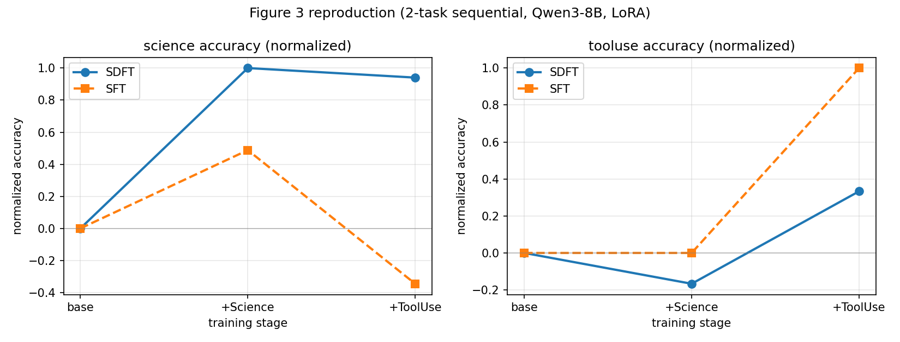
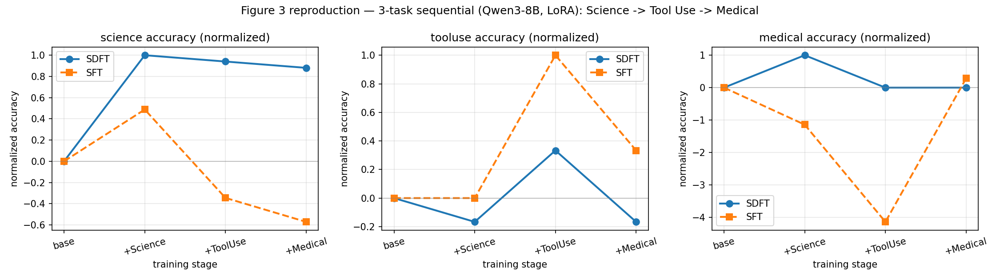
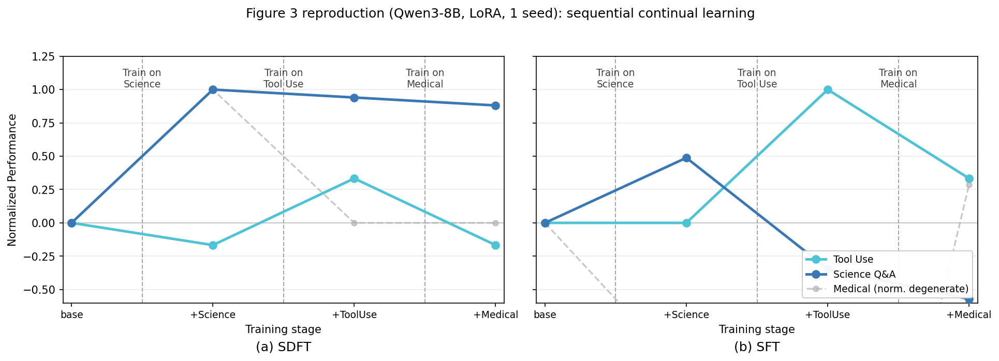

# Figure 3 Reproduction — Results

Reproduction of Figure 3 ("long-horizon sequential continual learning") from
*Self-Distillation Enables Continual Learning* (arXiv 2601.19897), adapted to available
resources. One model is trained **sequentially** on two Skill-Learning tasks (Science Q&A →
Tool Use) under **SDFT** and **SFT**, evaluated on both tasks after each stage, and normalized
per task (0 = base accuracy, 1 = best accuracy across both methods & stages).



## Headline result

The central claim reproduces: **SDFT accumulates skills without forgetting; SFT forgets the
earlier skill.** On the Science axis, after learning Tool Use:
- **SDFT retains Science** (normalized 1.0 → 0.94; raw 0.578 → 0.568).
- **SFT catastrophically forgets Science** (normalized 0.49 → **−0.35**; raw 0.493 → 0.355,
  i.e. *below* the base model's 0.412).

Both methods learn the new task (Tool Use) at stage 2. SFT reaches a higher absolute Tool Use
number (0.660 vs SDFT 0.619); SDFT trades a little new-task gain for near-perfect retention of
the earlier skill — exactly the Figure 3 trade-off.

## Raw accuracies (accuracy.json)

| checkpoint | science | tooluse |
|---|---|---|
| base (Qwen3-8B) | 0.4122 | 0.5979 |
| SDFT after Science | 0.5779 | 0.5876 |
| SDFT after Science+ToolUse | 0.5680 | 0.6186 |
| SFT after Science | 0.4931 | 0.5979 |
| SFT after Science+ToolUse | 0.3550 | 0.6598 |

Eval sets: science 507 examples (exact-match on `<answer>`), tooluse 97 examples (tool-call
regex match). 1 seed.

## Deviations from the paper (all deliberate, for resources/hardware)

- **2 tasks, not 3.** The paper's Figure 3 uses Science → Tool Use → **Medical**; the Medical
  (HuatuoGPT-o1) dataset is not shipped in this repo, so this is a faithful 2-task reduction.
- **Qwen3-8B**, not Qwen2.5-7B (paper) or Qwen3.5-9B (originally requested). Qwen3.5-9B needs
  `transformers>=5` / `vllm>=0.17` and is a hybrid-linear-attention MoE the SDFT trainer wasn't
  built for; Qwen3-8B is a standard dense model the pinned stack supports.
- **LoRA** (r=16, α=32) instead of full fine-tuning — fits an 8B model + vLLM colocate on one
  48 GB A6000 (paper used a 140 GB H200).
- **Thinking mode OFF.** Qwen3 defaults to emitting `<think>` blocks; the paper's Qwen2.5-Instruct
  has no thinking mode. We force non-thinking (probe: science exact-match 5/8 off vs 1/8 on) so
  Qwen3 behaves like the paper's instruct model and matches the `<reasoning>/<answer>` format.
- **No EMA teacher under LoRA.** SDFT's teacher is the demonstration-conditioned *base* model
  (student's own base with the LoRA adapter disabled); the slow EMA teacher (α=0.01) is disabled
  because its parameter-sync is incompatible with a LoRA student. The on-policy mechanism that
  drives the anti-forgetting result is preserved.
- **LR 1e-4** (LoRA needs a higher LR than the paper's full-FT 1e-5). SDFT 2 epochs, SFT 1 epoch,
  effective batch 32, cosine + 10 warmup steps, bf16, seed 42.
- 1 seed → no error bars; small eval sets → some noise in absolute numbers. The reproduction
  targets the qualitative trend, which holds clearly.

## Note: why SFT ≈ SDFT on Tool Use (not a bug)

SDFT does not beat SFT on the Tool Use axis (0.619 vs 0.660), unlike on Science (0.578 vs
0.493). This is expected, not a defect:

- The gap is **4 of 97 examples** (z ≈ 0.6) — within noise; the two methods are tied on Tool Use.
- **Base Qwen3-8B already scores 0.598 on Tool Use** — little headroom. SDFT distills from a
  demonstration-conditioned teacher; when the base is already strong, that teacher is barely
  better than base, so there is little signal to distill. Gains track headroom: Science (base
  0.412) → SDFT +0.166 vs SFT +0.081; Tool Use (base 0.598) → SDFT +0.021 vs SFT +0.062.
- SDFT's Tool Use "misses" are well-formed, sensible tool calls that differ on a subtle argument
  under exact-match — not format or tool-selection failures.
- Consistent with the paper's §4.4 / Figure 5: SDFT's advantage scales with how much the model can
  gain in-context; a high-base-rate task leaves little to gain.

The Figure 3 *forgetting* claim is carried by the earlier task (Science), which has the headroom:
SDFT retains it, SFT forgets it.

## 3-task extension — full Figure 3 (Science → Tool Use → Medical)

The Medical task (HuatuoGPT-o1) was built (`prep_medical.py`; train = medical-o1-reasoning-SFT,
eval = medical-o1-verifiable-problem, 507 short-answer questions graded by normalized containment)
and the experiment re-run as the paper's full 3-stage sequence. Figure:
`figure3_reproduction_3task.png` (3 panels, one per task; 4 stages: base, +Science, +ToolUse, +Medical).



**Paper-layout version** (`figure3_reproduction_paper_style.png`, via `plot_fig3_paper_style.py`)
matches the paper's Figure 3 layout — two panels **(a) SDFT | (b) SFT**, one line per task, with
training-phase dividers. Deviations are data-driven, not stylistic: x-axis is discrete training
**stage** (we evaluated only at stage boundaries, not continuously per gradient step); **1 seed**
(no confidence bands); and the **Medical** line is greyed as its normalization is degenerate
(base ≈ max headroom). Science is the load-bearing result: SDFT retains it, SFT forgets it.



### Raw accuracies (accuracy_3task.json)

| checkpoint | science | tooluse | medical |
|---|---|---|---|
| base (Qwen3-8B) | 0.4122 | 0.5979 | 0.1815 |
| **SDFT** +Science | 0.5779 | 0.5876 | 0.1953 |
| **SDFT** +Science+ToolUse | 0.5680 | 0.6186 | 0.1815 |
| **SDFT** +Science+ToolUse+Medical | 0.5582 | 0.5876 | 0.1815 |
| **SFT** +Science | 0.4931 | 0.5979 | 0.1657 |
| **SFT** +Science+ToolUse | 0.3550 | 0.6598 | 0.1243 |
| **SFT** +Science+ToolUse+Medical | 0.3176 | 0.6186 | 0.1854 |

### Reading it

- **Science (the retention story, has headroom).** After sequentially learning all three tasks,
  **SDFT retains Science at 0.558** (normalized 0.88) — barely below its post-Science peak of 0.578.
  **SFT decays to 0.318** (normalized −0.57), well *below* base (0.412): learning Tool Use then
  Medical progressively erased Science. This is the Figure 3 result.
- **Medical erosion under SFT.** SFT's Medical drops 0.182 → 0.166 → 0.124 as it trains Science then
  Tool Use (forgetting a skill it had zero-shot), then recovers to 0.185 only once Medical is finally
  the training task. SDFT holds Medical flat (~0.18) throughout — no erosion.
- **Tool Use.** Both learn it; SFT peaks higher (0.660 vs 0.619) — the high-base-rate / low-headroom
  tie discussed above.

### Caveat on the Medical panel's y-axis

The Medical panel's normalization is near-degenerate: base (0.182) ≈ max-across-methods (0.195), so
the denominator is tiny (0.013) and small raw swings blow up (SFT's 0.124 becomes −4.1 normalized).
The Medical *raw* numbers are the honest read — Medical has almost no headroom above base for either
method, so its normalized panel is visually dramatic but represents ≤0.06 absolute movement. The
load-bearing panel is Science, which has real headroom and shows the clean SDFT-retains / SFT-forgets
split.

## How to reproduce

```bash
# 0. env (pinned) + non-thinking base eval dir
uv venv --python 3.12 && uv pip install -r requirements.txt
uv pip uninstall deepspeed              # accelerate imports it; it needs a CUDA toolkit this box lacks
uv run python nothinking.py --out ckpt/base

# 1. train both arms sequentially (SDFT on 4 GPUs via DDP, SFT single-GPU) + merge between stages
LR=1e-4 bash run_fig3.sh                 # or drive stages manually (see the workspace ledger)
#    every vLLM run needs: VLLM_USE_FLASHINFER_SAMPLER=0   (venv-only CUDA)

# 2. evaluate the 5 checkpoints on both tasks, collect, plot
bash eval_grid.sh                        # avoid GPUs used by other jobs
uv run python collect_accuracy.py
uv run python plot_fig3.py               # -> results/fig3/figure3_reproduction.png
```

Design spec: `docs/superpowers/specs/2026-08-11-figure3-reproduction-design.md`.
Implementation plan: `docs/superpowers/plans/2026-08-11-figure3-reproduction.md`.
